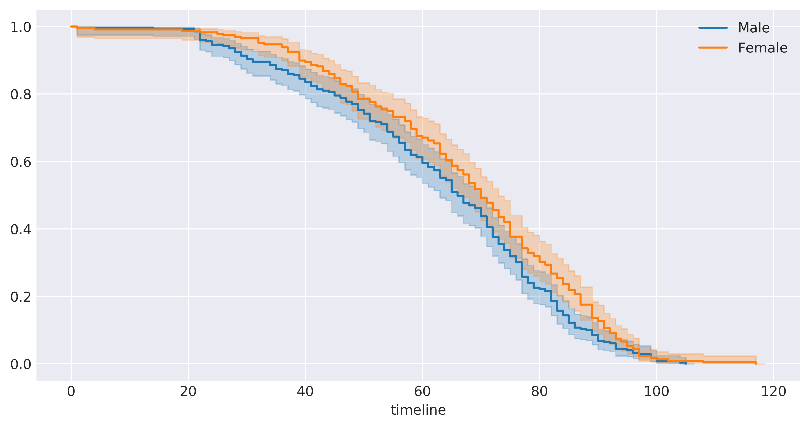
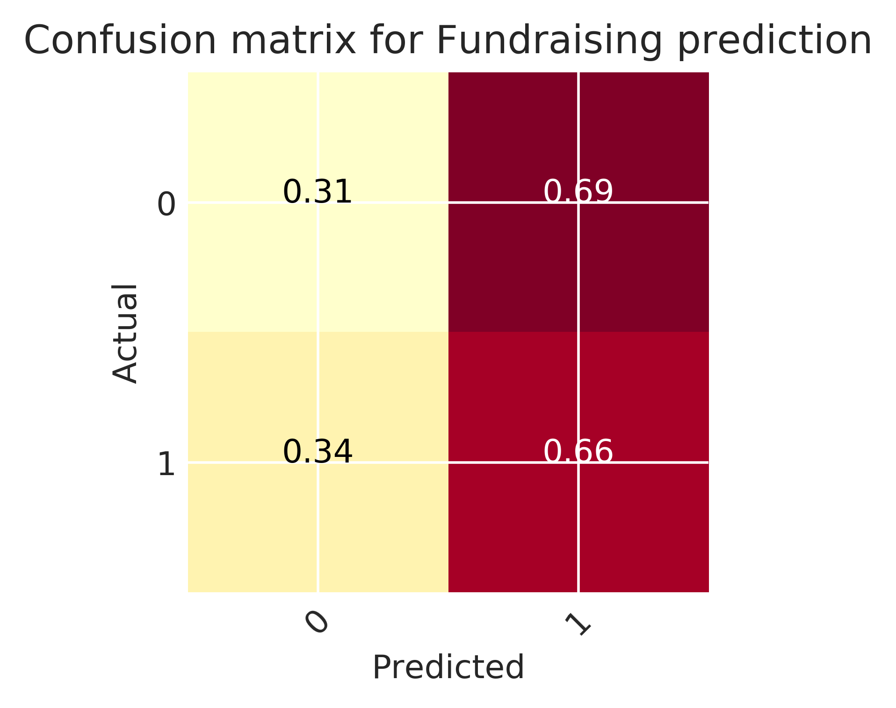

# life Insurance Analysis
In this project we create Kaplan-meier survival curve to determine if `Men` are at higher risk of death than `Women`. `ExtraTreesClassifier` is also use to predict funeral that will requires fundraising.

## Visualization of the suggested cohort
From the figure below, there is small difference between men and women death age. The variable if the spouse is alive shows significant difference in life expectancy. 

## Kaplan-Meier curves
For all the data that we have, we have observed birth and death of all the subjects, thus we will not have any censored record.
At 95% confidence interval there is significant difference between `Male` and `Female` death age. As expected the death age is a little lower for `Male` comapred to `Female`

The `hazard ratio is 1.651`. Therefore the risk of death for `Male` is 1.651 times higher compared to `Female`.

## Fundraising Classification
This section develop a model to predict if fundraising will be required.

### Feature Engineering
#### Feature Scaling
Based on the distribution of the variables the following scaling method were used:
* `StandardScaler` the scaler was used to scale;`Age`
* `MinMaxScaler`, this scaler was used to scale; `No_of_Children`, `Significant_Children`, and `Significant_Relatives`
* `RobustScaler`, this caler was used used to scale; `Size`, and `Word_Count`
#### Encoding Categorical Data
The following varibles were converted to number:
* `Fundraising`
* `Color`
* `Gender`

### Train the Model
The data was divided is divided into training and testing set. The testing set is consist of 25 percent of the datasets.

#### Hyper Parameter Tunning
To determine the best parameters for the model `RandomizedSearchCV` is used to train the model 30 times using random parameters
The model is then trained using the best parameters from `RandomizedSearchCV` using the full training set

### Model Evaluation
To evaluate the performance of the model, the model is used to predict the `y_test`
* `f1_score = sklearn.metrics.f1_score(y_test, y_pred)`
    the value of the f1_score is 0.634
* `tn, fp, fn, tp = sklearn.metrics.confusion_matrix(y_test, y_pred).ravel()`
* `sensitivity = tp / (tp + fn)`
    the value of the sensitivity is 0.657
* `specificity = tn / (tn + fp)`
    the value of the specificity is 0.3095
From the figure below only 31 percent Funel that do not require fundraising are classified correctly and 61 percent of the recors that require fundraising are classified correctly

The four most important feature from the figure below are `Age`, `Word_Count`, `Size`, and `Significant relatives`.

# Notes
Only Python 3 Supported